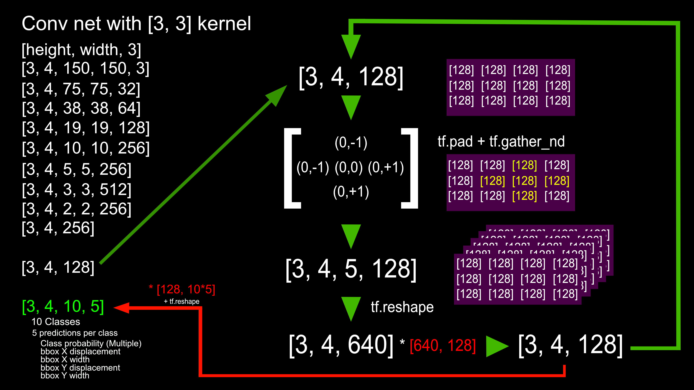

# NCCNN
Neighboring Collaborative Convolutional Neural Networks

Skip to [How to Run](#How-to-Run) Guide

See our proposal for this project [here](docs/proposal.pdf)

## About this project

Combines K-Nearest Neighbors and Convolutional Neural Network (CNN) techniques with the use of capsules to create a collaborative network of neurons. This project was originially for the project requirement of the Machine Learning graduate level course at Worcester Polytechnic Institute (WPI). Our team decided to pursue an innovative way to compete in the [Google AI Open Images - Object Detection Track competition](https://www.kaggle.com/c/google-ai-open-images-object-detection-track) on Kaggle when it runs again next year. The data sets used in this project are linked in the [Data section](#Data) below.

### Methodology



For our model we combined and used regular tensorflow convolutional layers. Once the layers encoded the image to a desired shape we used the tf.reshape, tf.gather_nd and tf.pad to implement our idea. 

### Results

(Pending as this is a continious project beyond our class.)

## Data

### Original Data Sets used:

[Data and Validation sets](https://www.figure-eight.com/dataset/open-images-annotated-with-bounding-boxes/) in csv files can be found under the Data tab

[Class Names Data](https://storage.googleapis.com/openimages/web/download.html) is located under Meta Data on this page

### Actual Data Sets used:

[Berkeley DeepDrive](http://bdd-data.berkeley.edu/) *Must create a log in to be able to download the data set*

Once the data set is downloaded to your local machine, place the images and labels from the download into the bdd100k directory.

## How to Run

Follow what's below here for installation and training examples.

### Machine Requirements

In order to run our code your machine must have the following:
- 6GB CPU
- (Optional) 6GB GPU if running with GPU for faster processing

If using GPU, also need:
- NVIDIA Graphics card with GPU drivers using Cuda 9.0
- cuDNN SDK 7.4

(Can update the above when installing TensorFlow below)

- NVIDIA Developer Account (Can be obtained for free at: https://developer.nvidia.com/developer-program)

For TensorFlow to work:
- Ubuntu 16.04 or later
- Windows 7 or later
- macOS 10.12.6 (Sierra) or later (no GPU support)
- Raspbian 9.0 or later

### Installation

1. __Clone the repository__ to your computer by using HTTPS or SSH (or download it) using the commands in the green drop down menu at the top of the repository. 

2. __Update__ your system with:
   ```
   sudo apt-get update
   ```

3. Check for __Python 3.6__ *(Not Python 3.7! This is not supported by TensorFlow yet.)*

   To check the version you're running: 
   ```
   python -V
   ```

   To install: 
   ```
   sudo apt-get install python3.6
   ```

4. __Install pip3__:
   ```
   sudo apt install python3-pip
   ```

5. __Install TensorFlow/TensorFlow-GPU__: https://www.tensorflow.org/install/

   __In addition, follow this guide in TensorFlow for GPU version:__ https://www.tensorflow.org/install/gpu

### Training

See [Tutorial Notebook](train_notebook.ipynb) for a tutorial.

See [Training Notebook](train_notebook.ipynb) for examples on how to train.
